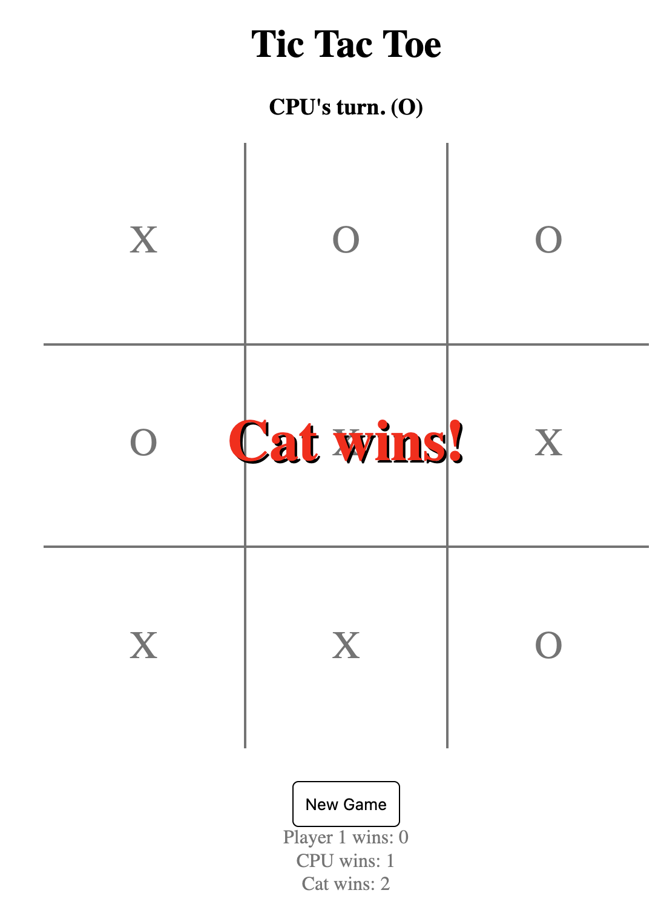

# Tic-Tac-Toe V2

A fully functional Tic-Tac-Toe game built using **pure HTML, CSS, and JavaScript**. I created this project early in my learning journey, and it gave me _a ton_ of hands-on experience. While the code could definitely be refined now, it was a great learning milestone and a solid foundation.

## Features

- Single-player and two-player modes
- Simple but strategic CPU opponent (blocks and wins when possible, but is winnable to make it fun)
- New Game button
- Score tracking for both players and cat games (draws)
- Clean layout with responsive interactions
- Prevents duplicate moves and handles game-over states

## File Structure

```
Tic-Tac-Toe-V2/
├── index.html       # HTML layout for player forms and game board
├── script.js        # All game logic, including AI and UI interactions
└── styles.css       # Styling for the game board and UI components
```

## Demo

👉 [Live Demo](https://your-deployment-link.com)  
_Note: I wrote this before studying LeetCode and advanced JS topics — so it’s a bit verbose, but fully functional!_

## Screenshot


